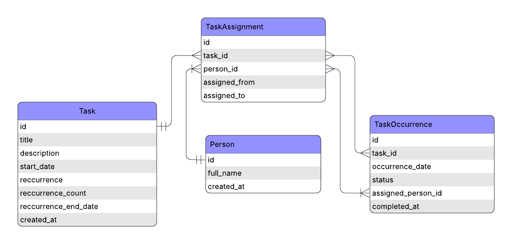

# Date Modeling Assignment

# Conceptual Data Model

## Business Glossary for Tasks Prompt
- There are a set of 3 taks that all have to be assigned to people, and have to be executed given the constraints (Task 1: repeats monthly and ends after 12 occurrences, Task 2: occurs once, Task 3: occurs daily and ends after 30 occurrences)
- Multiple people can be assigned to each task, but the task can only be executed (occur/reoccur) given the constraints
- Assumption example: 
    - Task 3, which repeats daily can be done by any of the three people, but more than one person cannot perform 
    Task 3 on the same day as another, and the task reoccurrence ends after it's set number of reoccurrence constraints are met with a `Completed` `Status` for the respective task reoccurrence count.
- Contextualized Problem Statement:
    - A grocery store has an established set of tasks that need to be performed on a specific cadence.
        - In January there needs to be a daily count of the number of sales of a given set of items to see how they compare to the average of the past year of those same set of items.
        - Once at the beginning of the year a staff memeber is responsible for the task of selecting the following year's list/set of items that will be tracked and compared the following January.
        - Once every month any staff memember will be responble for reporting on the number of sales for those selected items over that month.
    - The responsiblities of these tasks are selected at random by management and assigned at the end of the year.

## Design Summary
The design approach for this set of task requirements is one of a star schema with fact and dimensional tables. Dimension tables originate from the fact table `task_assignment`, where tasks are assigned to persons over a specific timeframe, progression is logged in the `task_occurence` table. The dimensional tables are `person` for each person in the fact table, and `task` for each task.

**Tables**
- **Person**: a staff member who can be assigned tasks
- **Task**: definition containing recurrence rules (none/daily/weekly/monthly)
- **TaskAssignment**: mapping of staff members to tasks (task-level assignment)
- **TaskOccurrence**: a scheduled instance of a Task on a particular date

## Design Logic


**Task and Person Tables**
Created as dimension tables based on the following:
- Static data
- Derived from fact tables
- Slow changing dimensions: tasks, requirements, persons, reccurrence_count from prompt

**Task Assignment and Task Occurrence**
Facts and event based table logic given the following:
- More dynamic; individual persons can be assigned to task on a changing schedule
- Status and date tracking; updates to the task_occurrence and task_assignment table are highly influential
- Occurrences are materialized into `task_occurrence` for easy querying and status tracking
- `task_assignment` handles who "owns" or is responsible for a Task over a given timeframe

**Catch Alls**
- Fact tables were designed with strict data constraints in place to improve data integrity and schema evolution
    - Task_occurrence: unique task_id, and occurence_date constraints to ensure tasks occurrences do not overlap
    - Task_assignment: unqiue task_id, person_id, and assigned_from, assigned_to constraints to ensure persons are not assigned to the same task on the same days
    - Type casting was created to ensure ingested `status` and occurrence types meet the requirements criteria
    - Trigger function created to generate a timestamp (`complete_at`) for any task with an updated `Completed` `Status` in the `task_occurrence` table

**Indexing Optimization**
Indexing for common query patterns
- Task
    - `start_date`
- Task Occurrence
    - `occurrence_date`
    - `task_id`
    - `status`
- Task Assignment
    - `task_id`
    - `assigned_from`

**Data Dictionary**
- Task
    - id: (PK) INT
    - title: VARCHAR(255), NOT NULL
    - description: VARCHAR(255)
    - start_date: DATE, NOT NULL
    - recurrence: task_recurrence_type ('none', 'daily', 'weekly', 'monthly'), NOT NULL
    - recurrence_count: INT
    - recurrence_end_date: DATE
    - created_at: TIMESTAMP
- Person
    - id: (PK) INT
    - full_name: VARCHAR(255), NOT NULL
    - created_at: TIMESTAMP
- Task Assignment
    - id: (PK) INT
    - task_id: (FK) INT, NOT NULL
    - person_id: (FK) INT, NOT NULL
    - assigned_from: DATE
    - assigned_to: DATE
- Task Occurrence
    - id: (PK) INT
    - task_id: (FK) INT
    - occurence_date: DATE, NOT NULL
    - status: task_status (Not Started, In Progress, Completed), NOT NULL
    - assigned_person_id: (FK) INT
    - complete_at: TIMESTAMP


**Queries and Data Operations**
```sql
-- 1) Create a trigger function for completed tasks
CREATE OR REPLACE FUNCTION set_completed_date() RETURNS trigger AS $$
BEGIN
    -- Check if the new status value is 'Completed'
    IF NEW.status = 'Completed' THEN
        -- Set the completed_date to the occurrence_date
        NEW.completed_at := NEW.occurrence_date;
    END IF;
    -- Return the modified new row
    RETURN NEW;
END;
$$ LANGUAGE plpgsql;

-- creating trigger
CREATE TRIGGER trigger_set_completed_date
BEFORE INSERT OR UPDATE OF status ON task_occurrence
FOR EACH ROW
EXECUTE FUNCTION set_completed_date();
```

```sql
-- 2) random updates of task status'
UPDATE task_occurrence
SET status = (ARRAY['Not Started', 'In Progress', 'Completed'])[floor(random() * 3 + 1)]::task_status;
```

```sql
-- 3) Task history for person_id = 3
    -- looking at the task occurrence history for single person
SELECT
	o.*,
	t.title
FROM task_occurrence o
JOIN task t
	ON t.id = o.task_id
WHERE o.assigned_person_id = 3
ORDER BY o.occurrence_date DESC;
```

```sql
-- 4) sample query to view assignments and occurrences for a specific person
SELECT o.*
FROM task_occurrence o
JOIN task_assignment a ON o.task_id = a.task_id
WHERE a.person_id = 2 AND o.occurrence_date BETWEEN a.assigned_from AND COALESCE(a.assigned_to, o.occurrence_date)
ORDER BY o.occurrence_date;
```

## Pros and Cons
**Pros**
- Status Tracking: each occurrence has it's own status, progress can be tracked independently
- Flexible assignment logic: supports both task-level assignment and per-occurrence overrides, via `task_assignment` and `assigned_person_id` respectively
- Separation of concerns: task definition (rules, and cadance) is cleanly separated from scheduled instances
- Referention integrity: CASCADE deletes ensure orphaned data doesn't accumulate
- Indexes on common patterns: covering indexes on `occurrence_date`, `status`, `task_id` speed up typical queries

**Cons**
- Storage overhead: pre-materialized occurrences require upfront storage, recurring tasks over years explode in size for tasks with high frequency
- Manual maintenance burden: occurrences must be explicitly generated and managed; no automatic regenration if reccurrence rules change
- Limited horizon: finite `reccurrence_count` is unrealistic and long term would become unwieldy
- No audit trail: Only `completed_at` is tracked; no history of status transitions or re-assignments
- No Timezone awareness for some date columns


## Future Work
**Advanced Dependency and Logic**
- Complex Reccurrence support: The business could request for specific (non-standard) days of the week/month/year to have task executed; we would then implement recurrence rule in addition to the reccurrence count
- Dependency Mapping: Business could request for certain tasks to be executed before others; implementing a parent-child task-dependency table for task dependency constaints

**Data Quality and Observability**
- Implementing constraints to the task_occurrence table that ensure task completion is not performed before the occurrence dates
- Audit logging for the task occurrence table can be established by creating a occurrence_history table that logs status transitions; the same can be applied to the task_assignment table to track changing assigned tasks between persons

**Nice-to-Haves**
- Creating notification integrations for Slack or email to provide notifications for tasks completed, and tasks not complete past occurrence dates

